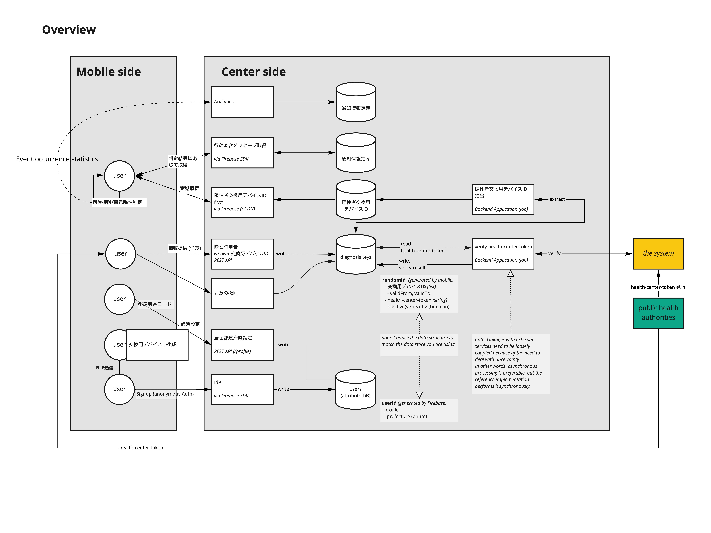
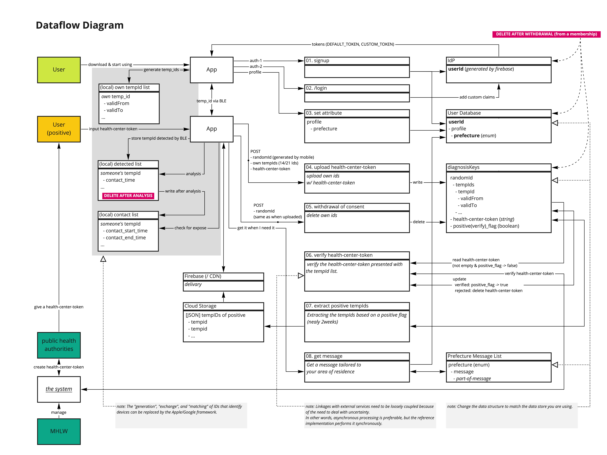
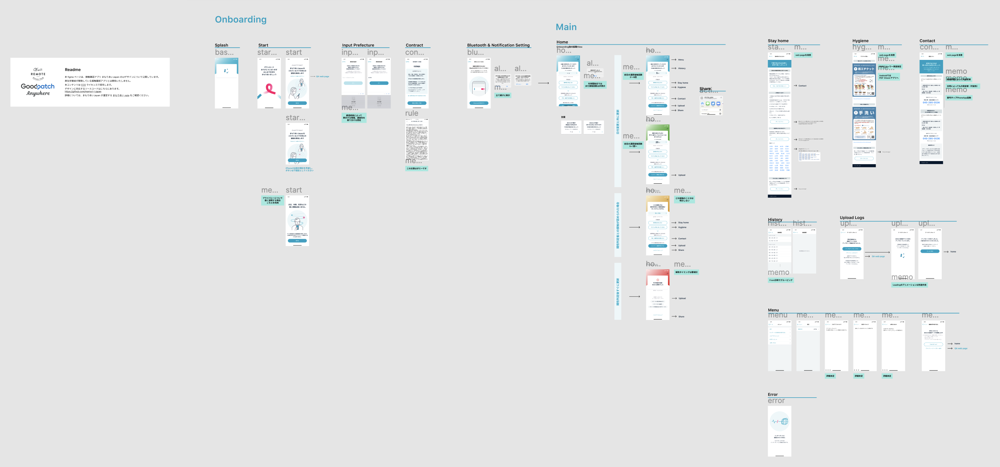

# mamori-i-japan-ios

## Architecture

### Overview and Data Flow Diagram





The images made by [Miro](https://miro.com/app/board/o9J_ksGHtPE=/) (read only access).

## Screenshot



- [Screens](./docs/screens.pdf)
- figma will be public soon.

## 環境

- Xcode 11.3以上
- Swift 5.1
- iOS 11.0以上

## 開発環境

- MacOS 10.15.4
- Xcode11.3
- Homebrew 2.2.12
- Mint 0.14.1 (0.14.0以上)

## セットアップ

```
$ make bootstrap
```

## お問い合わせ

- [お問い合わせフォーム](https://docs.google.com/forms/d/e/1FAIpQLSfcGM9itQ3i--GN9FUsQpdlW58Ug4Y6lcnE11N-igILDJdZlw/viewform)